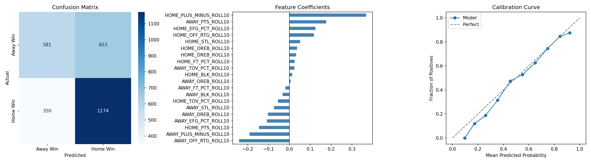

# NBA Game Predictor

A machine learning model that predicts the winner of an NBA game using team performance data from the last 10 seasons. Built with logistic regression on rolling advanced stats pulled from the NBA API.



## How It Works

1. **Data**: Pulls game logs for every NBA team from 2014–2026 using `nba_api`
2. **Features**: Engineers rolling 10-game averages for offensive rating, effective FG%, turnover rate, plus/minus, and more
3. **Model**: Trains a logistic regression classifier on 10,833 games, tested on 2,778 held-out games
4. **Prediction**: Given a home and away team, outputs win probability for each side

## Model Performance

| Metric | Value |
|--------|-------|
| Test Accuracy | 61.5% |
| 2025-26 Accuracy | 64.3% |
| Baseline (always pick home) | 56.3% |
| Log Loss | 0.651 |

The model outperforms the naive home-team baseline by ~5-8%. Strongest predictors are rolling plus/minus and offensive rating differential.

## Tech Stack

- **Data**: [nba_api](https://github.com/swar/nba_api)
- **Processing**: pandas, numpy
- **Model**: scikit-learn (Logistic Regression)
- **Visualization**: seaborn, matplotlib

## Setup

```bash
# Clone the repo
git clone https://github.com/YOUR_USERNAME/nba-game-predictor.git
cd nba-game-predictor

# Create virtual environment
python -m venv venv
source venv/bin/activate 

# Install dependencies
pip install -r requirements.txt
```

## Usage

```bash
# Run full pipeline (fetch data → clean → train model)
python main.py --pipeline

# Predict a game
python main.py --predict BOS GSW

# Example output
# ========================================
#   BOS (home) vs GSW (away)
# ========================================
#   BOS win probability:  64.3%
#   GSW win probability:  35.7%
# ========================================
#   Predicted winner: BOS
# ========================================
```

## Project Structure

```
nba_game_predictor/
├── data/                   # raw and processed game data (gitignored)
├── src/
│   ├── fetch_data.py       # pulls game logs from nba_api
│   ├── clean_data.py       # feature engineering and rolling averages
│   ├── train_model.py      # trains and evaluates logistic regression
│   └── predict.py          # loads model and predicts a matchup
├── models/                 # saved model and scaler (gitignored)
├── notebooks/
│   └── exploration.ipynb   # visualizations and analysis
├── assets/
│   └── evaluation.png      # model evaluation plots
├── main.py                 # pipeline orchestration
└── requirements.txt
```

## Features Engineered

All features are **10-game rolling averages** to capture current form:

- `OFF_RTG` — offensive rating (points per 100 possessions)
- `EFG_PCT` — effective field goal percentage
- `TOV_PCT` — turnover rate
- `FT_PCT` — free throw rate
- `PLUS_MINUS` — point differential
- `PTS`, `OREB`, `DREB`, `STL`, `BLK`

Each feature is computed for both home and away team, giving 20 total input features.

## Limitations & Future Improvements

- [ ] Incorporate injury and roster data
- [ ] Add player-level metrics (RAPTOR, EPM)
- [ ] Try gradient boosting (XGBoost) or neural network
- [ ] Build live in-game win probability model
- [ ] Add rest days and travel distance features

## Author

Richard Lai — University of Michigan
[GitHub](https://github.com/Richardlai03)
